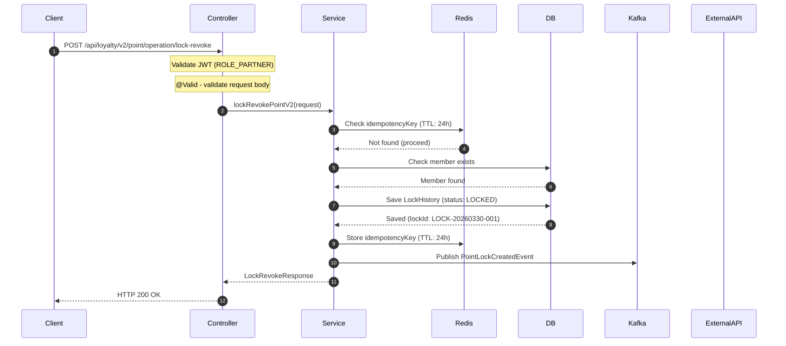

# API Documentation — Full Mode Section Templates

Read when building the document (after Phase 1 scan). Fill each section from scanned code + git analysis. Use actual values, never the placeholder strings below.

## Table of Contents

1. [Title](#section-1--title)
2. [Endpoint](#section-2--endpoint)
3. [Changelog](#section-3--changelog)
4. [Backward Compatibility](#section-4--backward-compatibility)
5. [Authentication & Authorization](#section-5--authentication--authorization)
6. [Rate Limiting](#section-6--rate-limiting)
7. [Request Headers](#section-7--request-headers)
8. [Request Parameters](#section-8--request-parameters)
9. [Request Body](#section-9--request-body)
10. [Response](#section-10--response)
11. [Error Responses](#section-11--error-responses)
12. [Async / Kafka Contract](#section-12--async--kafka-contract)
13. [Sequence Diagram](#section-13--sequence-diagram)

---

## Section 1 — Title

```
# API Documentation: {Human-Readable API Name}

> **Mode**: Full (Complete Internal Documentation)
> **Last Updated**: YYYY-MM-DD
> **Source Commit**: `{git commit hash}`
```

---

## Section 2 — Endpoint

```
## Endpoint

| Method | Full URI                          | Description               |
|--------|-----------------------------------|---------------------------|
| POST   | `/api/{version}/{resource}/{sub}` | One-line business summary |
```

---

## Section 3 — Changelog

```
## Changelog

| Version | Date       | Author / Commit | Changes                               |
|---------|------------|-----------------|---------------------------------------|
| v2.1.0  | YYYY-MM-DD | `a1b2c3d4`      | Added `partnerId` to request body     |
| v2.0.0  | YYYY-MM-DD | `e5f6a7b8`      | Initial release                       |

### Change Detail (latest version)
- Added: `field` - {reason}
- Removed: `field` - {reason}
- Renamed: `oldField` to `newField` - {reason}
- Changed type: `field` String to Integer - {reason}
- Behavior change: {description}
```

---

## Section 4 — Backward Compatibility

```
## Backward Compatibility

| Version | Status        | Summary                                                                            |
|---------|---------------|------------------------------------------------------------------------------------|
| v2.1.0  | ✅ Compatible  | `partnerId` is optional; existing clients are unaffected                           |
| v1.3.1  | ⚠️ BREAKING   | `currency` renamed to `currencyCode`; clients sending `currency` will receive null |

**Latest compatible version**: v{X.Y.Z}
```

- **Compatible**: new optional fields only.
- **BREAKING**: required field added, field removed/renamed, type changed, error code changed.

Per BREAKING entry add:
```
#### Migration Guide - v{X} to v{Y}
- Replace `currency` with `currencyCode` (ISO 4217) in all request payloads.
```

---

## Section 5 — Authentication & Authorization

```
## Authentication & Authorization

| Item             | Value                                            |
|------------------|--------------------------------------------------|
| Auth type        | JWT Bearer / OAuth2 / API Key / None             |
| Header           | `Authorization: Bearer <token>`                  |
| Token source     | {Identity Provider or issuer}                    |
| Required claims  | `sub`, `roles`, `scope: loyalty:write`           |
| Required roles   | `ROLE_PARTNER`, `ROLE_CUSTOMER`                  |
| 401 scenario     | Token missing, expired, or signature invalid     |
| 403 scenario     | Token valid but role/scope insufficient          |
```

---

## Section 6 — Rate Limiting

```
## Rate Limiting

| Item              | Value                              |
|-------------------|------------------------------------|
| Strategy          | Token bucket / Fixed window / None |
| Limit             | 100 requests per minute per user   |
| Key               | `userId` / `IP` / `partnerId`      |
| Exceeded response | HTTP 429 Too Many Requests         |
| Retry-After       | Returned in response header        |
| Config source     | {ClassName.java}                   |
```

> If none: "No rate limiting configured for this endpoint."

---

## Section 7 — Request Headers

```
## Request Headers

| Header              | Type   | Required | Example Value                          | Description              | Business Purpose (Why)                                          |
|---------------------|--------|----------|----------------------------------------|--------------------------|-----------------------------------------------------------------|
| `Authorization`     | String | Yes      | `Bearer eyJhbGci...`                   | JWT identity token       | Authenticates the partner and authorizes the operation scope.   |
| `X-Idempotency-Key` | String | No       | `550e8400-e29b-41d4-a716-446655440000` | Duplicate-prevention key | Prevents double-processing when the client retries on timeout.  |
| `Content-Type`      | String | Yes      | `application/json`                     | Request body format      | Must be JSON; other media types return 415.                     |
```

> **Cond.** = Conditionally required. Explain condition in Description cell.

---

## Section 8 — Request Parameters

```
## Request Parameters

### Path Variables

| Parameter  | Type   | Required | Description         | Business Purpose (Why)                           |
|------------|--------|----------|---------------------|--------------------------------------------------|
| `memberId` | String | Yes      | Member's loyalty ID | Scopes the operation to a single member account. |

### Query Parameters

| Parameter | Type    | Required | Default | Constraints | Description           | Business Purpose (Why)                              |
|-----------|---------|----------|---------|-------------|-----------------------|-----------------------------------------------------|
| `page`    | Integer | No       | 0       | Min: 0      | Result page (0-based) | Enables pagination to avoid large response payloads.|
```

> POST/PUT with no query params: state "No query parameters."

---

## Section 9 — Request Body

### 9.1 Idempotency & Concurrency

```
## Request Body

### Idempotency & Concurrency

| Item      | Value                                                                          |
|-----------|--------------------------------------------------------------------------------|
| Strategy  | Database Unique Index on `(idempotencyKey, memberId, partnerCode)`          |
| Key field | `idempotencyKey` - client must generate UUID v4 per unique transaction attempt |
| Behavior  | Duplicate key returns original response without re-executing business logic    |
```

### 9.2 Field Table

```
### Fields

| Field            | Type   | Required | Format / Constraints    | Description              | Business Purpose (Why)                                        | PII? |
|------------------|--------|----------|-------------------------|--------------------------|---------------------------------------------------------------|------|
| `memberId`    | String | Yes      | UUID v4, max 36 chars   | Member's loyalty account | Identifies which account the points operation applies to.     | No   |
| `idempotencyKey` | String | Yes      | UUID v4, max 36 chars   | Duplicate-prevention key | Prevents double-lock during network retries.                  | No   |
| `customerEmail`  | String | Cond.    | RFC 5321, max 255 chars | Customer's email address | Required for email-channel notification of lock confirmation. | Yes  |
| `amount`         | Long   | Yes      | Min: 1                  | Points to lock           | Core business value - defines how many points are reserved.   | No   |
```

> PII fields must never be logged.

### 9.3 Request Body Example

```json
{
  "memberId": "550e8400-e29b-41d4-a716-446655440000",
  "idempotencyKey": "7f3b1c20-1234-4abc-9def-000000000001",
  "amount": 500,
  "currency": "THB"
}
```

---

## Section 10 — Response

### 10.1 Response Headers

```
## Response

### Response Headers

| Header                   | Example Value      | Description                          | Business Purpose (Why)                                          |
|--------------------------|--------------------|--------------------------------------|-----------------------------------------------------------------|
| `Content-Type`           | `application/json` | Response body format                 | Always JSON for machine-parsing.                                |
| `X-Request-Id`           | `req-abc-123`      | Echoed request ID for tracing        | Enables end-to-end tracing back to the client's original request.|
| `X-Rate-Limit-Remaining` | `97`               | Remaining requests in window         | Lets the client self-throttle before hitting 429.               |
| `Retry-After`            | `60`               | Seconds until rate limit resets      | Tells the client exactly when to retry after a 429 response.   |
```

### 10.2 Response Body Fields

```
### Response Body

| Field    | Type    | Nullable | Description                       | Business Purpose (Why)                                              |
|----------|---------|----------|-----------------------------------|---------------------------------------------------------------------|
| `code`   | Integer | No       | HTTP status code (mirrored)       | Allows clients that can't inspect HTTP status to parse the outcome. |
| `status` | String  | No       | Status label (OK, BAD_REQUEST...) | Human-readable outcome for logging and UI display.                  |
| `data`   | Object  | Yes      | Success payload; null on error    | Contains committed operation details used by downstream flows.      |
| `errors` | Object  | Yes      | Error details; null on success    | Machine-parseable context for client error-handling logic.          |
```

### 10.3 Success Response Example

**HTTP 200 OK**

```json
{
  "code": 200,
  "status": "OK",
  "data": {
    "lockId": "LOCK-20260330-001",
    "expiredAt": "2026-04-01T00:00:00Z"
  },
  "errors": null
}
```

---

## Section 11 — Error Responses

Scan `@RestControllerAdvice` and error enums — document **all** error codes. Per status: one-line trigger + JSON matching actual project format. Use error format from Phase 1 error-handler scan. Status string, field names, structure must match actual code — not template below.

#### HTTP 400 — `@Valid` fails on mandatory field

```json
{"code":400,"status":"BAD_REQUEST","data":null,"errors":{"request":["idempotencyKey must not be blank","amount must be greater than 0"]}}
```

#### HTTP 401 — JWT missing/expired/invalid signature

```json
{"code":401,"status":"UNAUTHORIZED","data":null,"errors":{"request":["Authentication token is missing or invalid"]}}
```

#### HTTP 403 — JWT valid but role/scope insufficient

```json
{"code":403,"status":"FORBIDDEN","data":null,"errors":{"request":["Insufficient permissions. Required role: ROLE_PARTNER"]}}
```

#### HTTP 404 — Member/resource not found

```json
{"code":404,"status":"NOT_FOUND","data":null,"errors":{"request":["MEMBER_NOT_FOUND"]}}
```

#### HTTP 409 — `idempotencyKey` exists with different payload

```json
{"code":409,"status":"CONFLICT","data":null,"errors":{"request":["DUPLICATE_IDEMPOTENCY_KEY"]}}
```

#### HTTP 418 — Business rule violated (list ALL error codes — no "etc.")

```json
{"code":418,"status":"I_AM_A_TEAPOT","data":null,"errors":{"request":["INSUFFICIENT_POINT_BALANCE"]}}
```

#### HTTP 429 — Rate limit exceeded

```json
{"code":429,"status":"TOO_MANY_REQUESTS","data":null,"errors":{"request":["Rate limit exceeded. Retry after 60 seconds."]}}
```

#### HTTP 500 — Unexpected system failure

```json
{"code":500,"status":"INTERNAL_SERVER_ERROR","data":null,"errors":{"request":["Unexpected error occurred: [Exception Message]"]}}
```

---

## Section 12 — Async / Kafka Contract

Skip if Kafka not used.

```
## Async Contract (Kafka)

### Event Published

| Item      | Value                          |
|-----------|--------------------------------|
| Topic     | `loyalty.point.lock.created`   |
| Key       | `memberId`                  |
| Partition | By key hash                    |
| Trigger   | After successful DB save       |
```

**Event Payload**:
```json
{
  "eventType": "POINT_LOCK_CREATED",
  "lockId": "LOCK-20260330-001",
  "memberId": "550e8400-e29b-41d4-a716-446655440000",
  "amount": 500,
  "occurredAt": "2026-03-30T12:00:00Z"
}
```

```
### Event Consumed (if applicable)

| Item               | Value                             |
|--------------------|-----------------------------------|
| Topic              | `inventory.order.created`         |
| Consumer Group     | `loyalty-service-group`           |
| Idempotency        | Checked via `eventId` in DB       |
| On duplicate       | Skip silently, return ACK         |
| On failure         | Retry 3x with exponential backoff |
| Dead Letter Queue  | `inventory.order.created.DLT`     |
```

---

## Section 13 — Sequence Diagram



> Confluence: paste into Mermaid macro. If unavailable: `> Render with Confluence Mermaid app or draw.io.`
