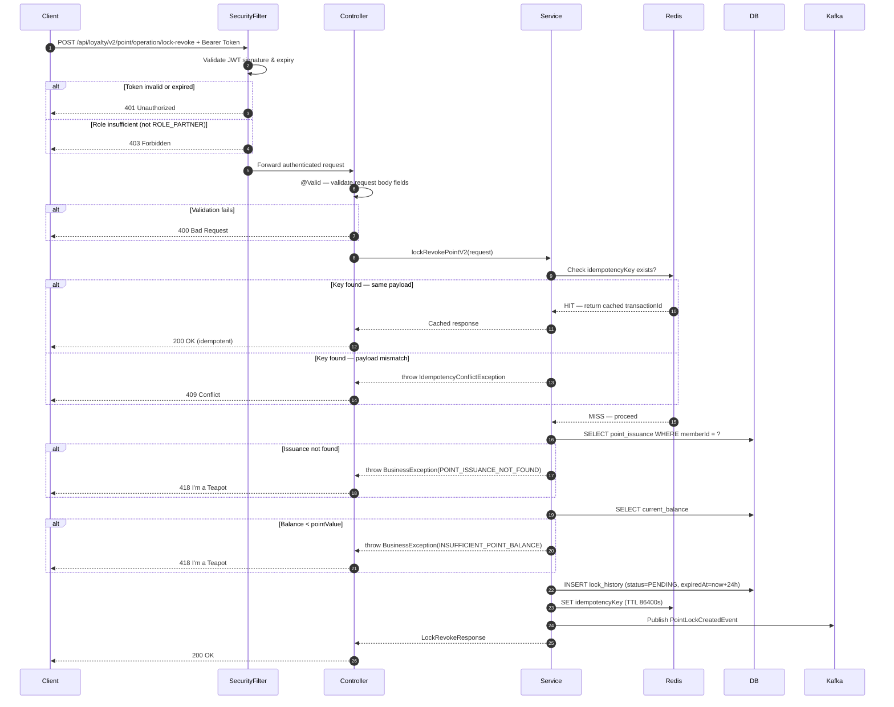

# API Documentation Skills — Examples

Three skills are available:

| Skill | Use when |
|-------|----------|
| `api-documentation-helper` | You are unsure which mode to use — it will ask and delegate. |
| `api-documentation-lite` | You know you want partner/third-party-facing docs. |
| `api-documentation-full` | You know you want complete internal docs with "Why" columns, changelog, Kafka, and diagrams. |

---

## Example 1: Full Vertical Trace — Lock Revoke Point (V2) [Full Mode]

**User**: "Document the `lockRevokePointV2` API using api-documentation-full."

**Skill scans**:
- `PointOperationV2Controller`, `PointOperationV2Service`, `PointOperationV2ServiceImpl`
- `PointLockRepository`, `PointLockKafkaProducer`, `GlobalExceptionHandler`, `SecurityConfig`, `ErrorCode` enum
- `git log -p` for the last 3 months on these files

**Output** (copy-paste into Confluence via Edit → Insert → Markup → Markdown):

---

# API Documentation: Lock Revoke Point (V2)

> **Mode**: Full (Complete Internal Documentation)
> **Last Updated**: 2026-04-02
> **Source Commit**: `a1b2c3d4`

---

## Endpoint

| Method | Full URI                                              | Description                                     |
|--------|-------------------------------------------------------|-------------------------------------------------|
| POST   | `/api/loyalty/v2/point/operation/lock-revoke`         | Lock loyalty points for a partner transaction   |

---

## Changelog

| Version | Date       | Author / Commit | Changes                                      |
|---------|------------|-----------------|----------------------------------------------|
| v2.1.0  | 2026-04-02 | `a1b2c3d4`      | 🟢 Added `partnerId` to request body          |
| v2.0.0  | 2026-03-20 | `e5f6a7b8`      | Initial V2 documentation                     |

### Change Detail (v2.1.0)
- 🟢 **Added**: `partnerId` — supports sub-partner scoping for multi-branch partners

---

## Backward Compatibility

| Version | Status       | Summary                                                               |
|---------|--------------|-----------------------------------------------------------------------|
| v2.1.0  | ✅ Compatible | `partnerId` is optional; existing clients are unaffected              |
| v2.0.0  | ✅ Compatible | Initial release                                                       |

**Latest compatible version**: v2.1.0

---

## Authentication & Authorization

| Item                | Value                                                        |
|---------------------|--------------------------------------------------------------|
| **Auth type**       | JWT Bearer                                                   |
| **Header**          | `Authorization: Bearer <token>`                              |
| **Token source**    | Internal Identity Provider                                   |
| **Required roles**  | `ROLE_PARTNER`                                               |
| **401 scenario**    | Token missing, expired, or signature invalid                 |
| **403 scenario**    | Token valid but caller does not hold `ROLE_PARTNER`          |

---

## Rate Limiting

| Item                  | Value                                          |
|-----------------------|------------------------------------------------|
| **Strategy**          | Token bucket (Bucket4j backed by Redis)        |
| **Limit**             | 200 requests per minute per API key            |
| **Key**               | Partner API key                                |
| **Exceeded response** | HTTP 429 Too Many Requests                     |
| **Retry-After**       | Yes — value in seconds                         |
| **Config source**     | `RateLimitConfig.java`                         |

---

## Request Headers

| Header              | Type   | Required | Example Value                          | Description              | Business Purpose (Why)                                            |
|---------------------|--------|----------|----------------------------------------|--------------------------|-------------------------------------------------------------------|
| `Authorization`     | String | Yes      | `Bearer eyJhbGci...`                   | JWT identity token       | Authenticates the partner and authorizes the operation scope.     |
| `Content-Type`      | String | Yes      | `application/json`                     | Request body format      | Must be JSON; other media types return 415.                       |
| `X-Request-Id`      | String | No       | `f47ac10b-58cc-4372-a567-0e02b2c3d479` | Client correlation ID    | Propagated through all downstream services for distributed tracing.|
| `X-Partner-Channel` | String | No       | `MOBILE`, `WEB`, `POS`                 | Request origin channel   | Used for channel-specific audit logging and analytics.            |

---

## Request Parameters

### Path Variables

None

### Query Parameters

None

---

## Request Body

### Idempotency & Concurrency

| Item          | Value                                                                            |
|---------------|----------------------------------------------------------------------------------|
| **Strategy**  | Database Unique Index on `(idempotencyKey, memberId, partnerCode)`           |
| **Key field** | `idempotencyKey` — client must generate a UUID v4 per unique transaction attempt |
| **Behavior**  | Duplicate key returns the original response without re-executing business logic   |

### Fields

| Field              | Type    | Required | Format / Constraints              | Description              | Business Purpose (Why)                                                   | PII? |
|--------------------|---------|----------|-----------------------------------|--------------------------|--------------------------------------------------------------------------|------|
| `memberId`      | String  | Yes      | UUID v4, max 36 chars             | Member's loyalty account | Identifies which account the points lock applies to.                     | No   |
| `idempotencyKey`   | String  | Yes      | UUID v4, max 36 chars             | Duplicate-prevention key | Prevents double-lock during network retries.                             | No   |
| `partnerCode`      | String  | Yes      | 3–10 uppercase alphanumeric       | Calling partner code     | Scopes audit trail, quota tracking, and reporting to the partner.        | No   |
| `pointValue`       | Long    | Yes      | > 0, max 10,000,000               | Points to lock           | Core business value — defines how many points are reserved.              | No   |
| `referenceNo`      | String  | Yes      | Max 50 chars                      | Partner's transaction ID | Stored for cross-system reconciliation between partner and loyalty platform.| No |
| `partnerId`        | String  | No       | UUID v4                           | Partner sub-entity ID    | Scopes the operation to a specific sub-partner or branch. Added v2.1.0.  | No   |
| `expireAfterHours` | Integer | No       | 1–72, default 24                  | Lock duration in hours   | Defines when the lock auto-releases if never confirmed.                  | No   |

### Request Body Example

```json
{
  "memberId": "550e8400-e29b-41d4-a716-446655440000",
  "idempotencyKey": "f47ac10b-58cc-4372-a567-0e02b2c3d479",
  "partnerCode": "PART001",
  "pointValue": 500,
  "referenceNo": "TXN-20260402-00123",
  "partnerId": "c2d3e4f5-a6b7-8c9d-e0f1-a2b3c4d5e6f7",
  "expireAfterHours": 24
}
```

---

## Response

### Response Headers

| Header                   | Example Value      | Description                      | Business Purpose (Why)                                            |
|--------------------------|--------------------|----------------------------------|-------------------------------------------------------------------|
| `Content-Type`           | `application/json` | Response body format             | Always JSON for machine-parsing.                                  |
| `X-Request-Id`           | `f47ac10b-...`     | Echoed correlation ID            | Enables end-to-end tracing back to the client's original request. |
| `X-Rate-Limit-Remaining` | `198`              | Remaining requests in window     | Lets the client self-throttle before hitting 429.                 |

### Response Body

| Field               | Type            | Nullable | Description                   | Business Purpose (Why)                                               |
|---------------------|-----------------|----------|-------------------------------|----------------------------------------------------------------------|
| `code`              | Integer         | No       | HTTP status code (mirrored)   | Allows clients that cannot inspect HTTP status to parse the outcome. |
| `status`            | String          | No       | Status label                  | Human-readable outcome for logging and UI display.                   |
| `data`              | Object          | Yes      | Success payload               | Contains committed lock details for downstream confirmation flows.   |
| `data.transactionId`| String (UUID)   | Yes      | System transaction ID         | Used for downstream confirmation or revoke calls and audit.          |
| `data.lockedPoints` | Long            | Yes      | Points actually locked        | Confirms what was locked (may differ if partial locking applies).    |
| `data.expiredAt`    | String (ISO 8601)| Yes     | Lock auto-release time        | Informs the client when to expect the lock to expire.                |
| `errors`            | Object          | Yes      | Error details map             | Machine-parseable context for client error-handling logic.           |

---

## Success Response Example

```json
{
  "code": 200,
  "status": "OK",
  "data": {
    "transactionId": "9b1deb4d-3b7d-4bad-9bdd-2b0d7b3dcb6d",
    "lockedPoints": 500,
    "expiredAt": "2026-04-03T10:30:00Z"
  },
  "errors": null
}
```

---

## Error Responses

### HTTP 400 — Validation Error

Triggered by `@NotNull`, `@NotBlank`, `@Min`, or `@Pattern` failures.

```json
{
  "code": 400,
  "status": "BAD_REQUEST",
  "data": null,
  "errors": {
    "memberId": ["must not be blank"],
    "pointValue": ["must be greater than 0"],
    "idempotencyKey": ["must be a valid UUID"]
  }
}
```

### HTTP 401 — Unauthorized

Triggered when the `Authorization` header is missing, JWT is expired, or signature is invalid.

```json
{
  "code": 401,
  "status": "UNAUTHORIZED",
  "data": null,
  "errors": {
    "request": ["Authentication token is missing or invalid"]
  }
}
```

### HTTP 403 — Forbidden

Triggered when the token is valid but the caller does not hold `ROLE_PARTNER`.

```json
{
  "code": 403,
  "status": "FORBIDDEN",
  "data": null,
  "errors": {
    "request": ["Insufficient permissions to perform this operation"]
  }
}
```

### HTTP 409 — Conflict (Idempotency Key Conflict)

Triggered when the same `idempotencyKey` is received with a different payload.

```json
{
  "code": 409,
  "status": "CONFLICT",
  "data": null,
  "errors": {
    "request": ["IDEMPOTENCY_KEY_CONFLICT"]
  }
}
```

### HTTP 418 — Business Logic Error

**Scenario: Point issuance not found**
```json
{
  "code": 418,
  "status": "I_AM_A_TEAPOT",
  "data": null,
  "errors": { "request": ["POINT_ISSUANCE_NOT_FOUND"] }
}
```

**Scenario: Insufficient point balance**
```json
{
  "code": 418,
  "status": "I_AM_A_TEAPOT",
  "data": null,
  "errors": { "request": ["INSUFFICIENT_POINT_BALANCE"] }
}
```

**Scenario: Lock already exists**
```json
{
  "code": 418,
  "status": "I_AM_A_TEAPOT",
  "data": null,
  "errors": { "request": ["LOCK_ALREADY_EXISTS"] }
}
```

### HTTP 429 — Too Many Requests

Triggered when the partner exceeds 200 requests per minute.

```json
{
  "code": 429,
  "status": "TOO_MANY_REQUESTS",
  "data": null,
  "errors": {
    "request": ["Rate limit exceeded. Retry after 30 seconds."]
  }
}
```

### HTTP 500 — Internal Server Error

Triggered by unhandled exceptions caught by `GlobalExceptionHandler.java`.

```json
{
  "code": 500,
  "status": "INTERNAL_SERVER_ERROR",
  "data": null,
  "errors": {
    "request": ["Unexpected error occurred: NullPointerException at PointOperationV2ServiceImpl:142"]
  }
}
```

---

## Async Contract (Kafka)

### Event Published

| Item          | Value                            |
|---------------|----------------------------------|
| **Topic**     | `point-lock-events`              |
| **Key**       | `memberId`                    |
| **Partition** | By key hash                      |
| **Trigger**   | After successful DB save         |

**Event Payload**:
```json
{
  "eventType": "POINT_LOCK_CREATED",
  "lockId": "LOCK-20260330-001",
  "memberId": "550e8400-e29b-41d4-a716-446655440000",
  "amount": 500,
  "occurredAt": "2026-03-30T12:00:00Z"
}
```

---

## Sequence Diagram

> **Confluence note**: Paste the block below into a Confluence **Mermaid macro**. If unavailable, use draw.io.



---

## Example 2: Change Detection — Rename Breaking Change [Full Mode]

**User**: "Check for API changes in the `payment` service and update the docs."

**Skill action**:
1. Run `git log -p` on `PaymentRequest.java`, `PaymentResponse.java`, `PaymentController.java`.
2. Detect `currency` renamed to `currencyCode` (required field).
3. Update Changelog and Backward Compatibility.

### Changelog (updated)

| Version | Date       | Author / Commit | Changes                                          |
|---------|------------|-----------------|--------------------------------------------------|
| v1.3.1  | 2026-04-01 | `d4e5f6a7`      | 🟡 Renamed `currency` → `currencyCode` in request |
| v1.3.0  | 2026-03-15 | `b2c3d4e5`      | 🟢 Added `merchantId` (optional)                  |
| v1.2.0  | 2026-02-10 | `a1b2c3d4`      | Initial documentation                            |

### Backward Compatibility (updated)

| Version | Status      | Summary                                                                              |
|---------|-------------|--------------------------------------------------------------------------------------|
| v1.3.1  | ⚠️ BREAKING | `currency` renamed to `currencyCode`; clients sending `currency` will receive null   |
| v1.3.0  | ✅ Compatible| `merchantId` is optional; existing clients are unaffected                            |

**Latest compatible version**: v1.3.0

#### Migration Guide — v1.3.0 → v1.3.1
- Replace `currency` with `currencyCode` (ISO 4217 3-letter code, e.g. `THB`) in all request payloads.
