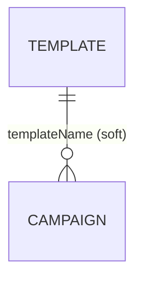

# Worked example: "Notification Gateway" database

Continues the same fictional service used in the `docs-architecture`/`docs-domain` skills'
reference examples, to show what this skill's output looks like end to end.

Source (`Campaign.java`):

```java
@Document(collection = "campaign")
@Data
public class Campaign extends BaseEntity {
  @Indexed(unique = true)
  private String name;
  private String templateName;      // soft reference, high confidence: -> Template.name
  private Set<String> recipientIds; // NOT "recipientIdNames" -- doesn't match the suffix
                                     // heuristic; the script will miss this one. A human
                                     // (or a grep for RecipientRepository calls in
                                     // CampaignService) is what actually catches it.
  private DeliveryRule deliveryRule; // no @DBRef -- an embedded value, not a relation at all
}
```

Generated `docs/database/campaign.md` (abbreviated):

```markdown
# `campaign` collection

Backing class: `Campaign` (`.../entity/Campaign.java`), extends `BaseEntity`.

## Fields

| Field | Type | Notes |
|---|---|---|
| `id` | `ObjectId` | inherited from `BaseEntity`; **primary key** |
| `name` | `String` | unique index |
| `templateName` | `String` | |
| `recipientIds` | `Set<String>` | |
| `deliveryRule` | `DeliveryRule` | |

## Relations

- References `template` via `templateName` (many-to-one, **soft** -- by name, not
  enforced by the database)

## Indexes

- `name` (unique)
```

Two things worth noticing, both flagged in `SKILL.md`:

1. `recipientIds` is a real relation to `Recipient` in this fictional domain, but the
   script produces **nothing** for it -- the field name doesn't end in `Name`/`Names`, and
   it isn't the bare plural of `recipient`'s slug either (`recipientIds` != `recipients`).
   This is exactly the kind of miss step 3 of the workflow exists to catch by reading
   `CampaignService`/`RecipientRepository` directly, not by trusting the script's silence.
2. `deliveryRule` is a `DeliveryRule`-typed field with no `@DBRef` -- almost certainly an
   **embedded document** (stored inline inside the `campaign` document), not a relation to
   a separate collection at all. The script correctly says nothing about it as a relation;
   don't manufacture one just because the field's type looks like an entity name. If
   `DeliveryRule` isn't itself `@Document`-annotated anywhere in the scanned path, that's
   further confirmation it's meant to be embedded, not standalone.

The generated `README.md`'s Mermaid diagram for this fictional example would show:



with `campaign -> recipient` added by hand after verifying it in step 3, since the script
had no signal to find it on its own.
