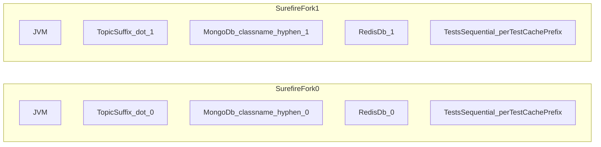

# Parallel Integration Test Implementation

When asked to "implement parallel test" or similar, follow this guide.

See also the project architecture rule: `CLAUDE.md` (stack, modules, and test debugging notes).

## Agent behavior

- **Always follow the Planning Phase below** before writing any code or making any edits. Do not skip straight to implementation.
- **Do not** run `mvn`, Gradle, Surefire, or other build/test commands **automatically** unless the user **explicitly** asks (e.g. "run the tests," "verify with Maven"). Parallel integration suites are slow and environment-dependent.
- **Do** suggest exact copy-paste commands when helpful, and **analyze** stack traces or log output the user pastes into the chat.
- **Scope of fixes:** For flakes or parallel-isolation issues, default to **test code, test configuration, and test helpers**. Do **not** change production application logic unless the user asks or investigation clearly proves an application bug (see `CLAUDE.md` debugging mindset).

**IDE vs Maven:** When running tests from the IDE, `surefire.forkNumber` is often unset; placeholders like `${surefire.forkNumber:0}` still resolve as fork `0`. Behavior under a full Maven Surefire run with forks remains the reference for topic suffixes, Mongo DB names, and Redis DB index.

---

## Planning Phase (required before any code change)

### Step 1 — Scan project context and test infrastructure

Before proposing anything, read the following (in parallel where possible):

**Project context (read first):**
- `CLAUDE.md` at the project root — tech stack, module structure, domain model, key services, Kafka topics, testing patterns, and lessons learned. Use this to understand what infrastructure already exists before scanning files.
- Any `*architecture*.md` files anywhere in the project (glob `**/*architecture*.md`) — may contain additional ADRs, module decisions, or integration notes not yet in `CLAUDE.md`.

**Test infrastructure:**
- `pom.xml` of the app module — check Surefire config, `forkCount`, JUnit version
- `BaseIntegrationTest` — check existing lifecycle hooks, imports, and annotations
- `junit-platform.properties` (if present)
- Test `application.properties` — check Kafka topic values and Redis DB config
- Any `KafkaTestHelper`, `WiremockApiHelper`, `StubApiHelper` helper classes

**What to extract from context files:** From `CLAUDE.md` / `*architecture*.md`, note:
- Which databases/message brokers are in use (MongoDB, Kafka, Redis, others)
- Which Feign clients or external services are mocked in tests (→ WireMock scope)
- Existing test patterns or helper classes already documented
- Any "lessons learned" that are directly relevant to parallel test isolation

Skip reading infrastructure files for details already covered by `CLAUDE.md` — use it as the source of truth and only open files when you need specifics not mentioned there.

### Step 2 — Ask uncertainties upfront (single block)

After scanning, present **only genuinely unresolvable** questions in one block before writing the plan. Do not ask them one at a time. Skip any question that Step 1 scanning already answered (e.g. if `BaseIntegrationTest` shows `SettableMongoDatabaseFactory` already wired, don't ask about it; if test `application.properties` already has `redis.database=...`, don't ask about Redis).

Questions to ask only if scanning left them open:

> Before I write the plan, I need to clarify a few things:
>
> 1. **JUnit version** — Are tests already on JUnit 5 (Jupiter), or is migration from JUnit 4 needed? *(ask only if JUnit 4 imports were found)*
> 2. **Fork count** — What `forkCount` should be used? (default suggestion: `4`)
> 3. **WireMock stubs** — Are there programmatic stubs via `StubApiHelper` in addition to fixture-based ones? *(ask only if `StubApiHelper` was found but cleanup is unclear)*
> 4. **Kafka topics** — Are all `@KafkaListener` annotations and test topic lookups already using property placeholders? *(ask only if hardcoded `EventNames` constants were found in test code)*

Aim for ≤ 2 questions. If scanning answered everything, skip this step and go straight to Step 3.

Wait for the user's answers before proceeding.

### Step 3 — Output a numbered plan

Present a numbered plan listing:
- Each file to be **created** or **modified**, and what change will be made
- The reason for each change, referencing the relevant section of this skill
- Any files that are already correctly configured (state "no change needed")

**Wait for explicit user approval** (e.g. "looks good", "go ahead") before writing any code.

### Step 4 — Verification command

After implementing all changes, show the user the exact command to verify (do not run it automatically):

```bash
mvn clean test -pl <app-module> -am
```

Replace `<app-module>` with the app module discovered in Step 1 (e.g. `my-service-app`).

Tell the user what to look for in the output: all forks completing, no `ConditionTimeout`, no `BeanDefinitionOverrideException`.

---

## Architecture: Fork-Level Parallelism

Use **Surefire forks** (separate JVMs) for parallelism, NOT JUnit 5 concurrent class execution. Each fork gets its own Spring context and isolated resources.



- Each fork runs test **classes** sequentially; isolation across forks uses fork-specific topic suffixes, Mongo database names, Redis DB index, and (optionally) per-test cache key prefixes within a fork.

## 1. Prerequisite: Migrate from JUnit 4 to JUnit 5

JUnit 5 (Jupiter) is required for `junit-platform.properties` parallel execution.

| JUnit 4 | JUnit 5 |
|---------|---------|
| `import org.junit.Test` | `import org.junit.jupiter.api.Test` |
| `import org.junit.Before` | `import org.junit.jupiter.api.BeforeEach` |
| `import org.junit.After` | `import org.junit.jupiter.api.AfterEach` |
| `@RunWith(SpringRunner.class)` | `@ExtendWith(SpringExtension.class)` or `@SpringBootTest` |
| `Assert.assertEquals(...)` | `Assertions.assertEquals(...)` |
| `@Test(expected = Foo.class)` | `assertThrows(Foo.class, () -> ...)` |

JUnit 4 tests are invisible to `junit-platform.properties` and will run sequentially regardless.

## 2. maven-surefire-plugin (pom.xml)

```xml
<plugin>
  <groupId>org.apache.maven.plugins</groupId>
  <artifactId>maven-surefire-plugin</artifactId>
  <configuration>
    <forkCount>4</forkCount>
    <reuseForks>true</reuseForks>
    <argLine>-Dsurefire.forkNumber=${surefire.forkNumber}</argLine>
  </configuration>
</plugin>
```

- `forkCount` should match available CPU cores. Use a fixed number or `1C` (1x cores).
- `reuseForks=true` reuses JVMs across test classes (faster than recreating).

## 3. junit-platform.properties

```properties
junit.jupiter.execution.parallel.enabled=true
junit.jupiter.execution.parallel.mode.default=same_thread
junit.jupiter.execution.parallel.mode.classes.default=same_thread
junit.jupiter.execution.parallel.config.strategy=dynamic
junit.jupiter.execution.parallel.config.dynamic.factor=1
```

- `mode.classes.default=same_thread` is mandatory -- classes within a fork share a `SettableMongoDatabaseFactory` instance, so concurrent classes would corrupt each other's DB routing.
- Parallelism comes from forks, not JUnit threads.

## 4. MongoDB Isolation via SettableMongoDatabaseFactory

Create a `SettableMongoDatabaseFactory` that wraps the real factory with a **plain mutable field** (no ThreadLocal needed since classes are sequential within a fork):

```java
public class SettableMongoDatabaseFactory implements MongoDatabaseFactory {
  private final MongoDatabaseFactory delegate;
  private String databaseName;

  // setDatabaseName(), clear(), getMongoDatabase() routes to custom name if set
}
```

Register it via `@TestConfiguration` with `@Primary`. **CRITICAL:** The `MongoTemplate` bean MUST keep the name `mongoTemplate` (same as production) and enable bean definition overriding. Do NOT rename it.

```java
@TestConfiguration
public class TestMongoConfiguration {
  @Bean @Primary
  public MongoDatabaseFactory settableMongoDatabaseFactory(MongoDatabaseFactory original) { ... }

  @Bean @Primary
  public MongoTemplate mongoTemplate(MongoDatabaseFactory mongoDatabaseFactory) { ... }
}
```

**Why the bean MUST be named `mongoTemplate`:**
- `@EnableMongoRepositories` resolves the `MongoTemplate` bean **by name** (`mongoTemplate`), NOT by `@Primary`
- A different name creates split-brain: repositories use the production `mongoTemplate` (wrong DB) while autowired fields use the test one (correct DB)
- Symptoms: NPEs in async flows, data leaks across tests, `@AfterEach` cleaning the wrong database

**Required property** -- add to `@TestPropertySource` or test `application.properties`:

```properties
spring.main.allow-bean-definition-overriding=true
```

**Fork-aware database name (required when multiple forks use a shared Mongo instance):** In `@BeforeAll`, set the database name to `getClass().getSimpleName().toLowerCase() + "-" + System.getProperty("surefire.forkNumber", "0")`. Without the fork suffix, two JVMs running the same test class would map to the **same** logical database name and corrupt each other's data. Keep the full name within MongoDB's **64-character** limit (short class names + `-` + fork id are usually enough; shorten the class segment only if needed).

## 5. BaseIntegrationTest Setup

```java
@TestInstance(TestInstance.Lifecycle.PER_CLASS)
@TestPropertySource(locations = {"/application.properties"},
    properties = {"spring.cloud.consul.enabled=false", "spring.cloud.vault.enabled=false",
        "spring.main.allow-bean-definition-overriding=true"})
@Import(TestMongoConfiguration.class)
public abstract class BaseIntegrationTest {

  @Autowired protected SettableMongoDatabaseFactory settableMongoDatabaseFactory;

  @BeforeAll
  public void setUpBeforeClass() {
    String forkNumber = System.getProperty("surefire.forkNumber", "0");
    String dbName = getClass().getSimpleName().toLowerCase() + "-" + forkNumber;
    settableMongoDatabaseFactory.setDatabaseName(dbName);
  }

  @AfterEach
  public void tearDownEach() {
    mongoTemplate.getCollectionNames().forEach(mongoTemplate::dropCollection);
    kafkaTestHelper.after();
    cacheService.flushDB();
    WireMock.reset();
  }

  @AfterAll
  public void tearDownParent() {
    mongoTemplate.getDb().drop();
    settableMongoDatabaseFactory.clear();
  }
}
```

- DB name = lowercase class name **plus** `-` and `surefire.forkNumber` (default `0` for IDE runs). Do not use arbitrary long prefixes; stay within MongoDB's 64-char database name limit.
- `@BeforeAll` must be non-static (uses `getClass()` and autowired field), requires `PER_CLASS` lifecycle.

## 6. WireMock Stub Isolation

WireMock stubs can leak between tests when multiple stubbing mechanisms are used. This project has two:

| Mechanism | How stubs are created | Tracked? |
|-----------|----------------------|----------|
| `WiremockApiHelper` | Loads from JSON fixture files, tracks in `REGISTERED_STUBS` | Yes -- cleared by `verifyAndClearMockApi()` |
| `StubApiHelper` | Created programmatically via `StubApiHelper.createStub()` | No -- not tracked by any cleanup method |

**Problem:** `verifyAndClearMockApi()` only clears stubs it tracks. Programmatic stubs from `StubApiHelper` persist across tests, causing a test to hit a stub left over from a previous test.

**Symptoms of stub leakage:**
- A test expecting an API error instead gets a 200 (from a leftover success stub)
- NPEs deep in service code because the service proceeded further than expected
- `AssertionFailedError: Expected LOCK_POINT_FAILED Actual SYSTEM_ERROR`
- Tests pass individually but fail when run together

**Fix:** Always call `WireMock.reset()` in `@AfterEach`. This is a nuclear cleanup that removes ALL stubs regardless of how they were created. Individual cleanup methods like `verifyAndClearMockApi()` become redundant but harmless.

**Before each test:** Call `WireMock.resetAllRequests()` in `@BeforeEach` (after other setup if needed) to clear the **request journal**. That reduces flaky "unmatched stub" / ordering issues when async HTTP calls from a prior test finish during the next test.

```java
@BeforeEach
public void setUpParent() {
    // ... kafka helper / cache flush ...
    WireMock.resetAllRequests();
}

@AfterEach
public void tearDownEach() {
    // ... other cleanup ...
    WireMock.reset();  // clears ALL stubs -- both fixture-loaded and programmatic
}
```

**Rule of thumb:** Every shared resource must be cleaned in `@AfterEach`. If there are two ways to create state (fixtures vs code), `@AfterEach` must handle both. Using the broadest cleanup method (e.g. `WireMock.reset()` instead of removing individual stubs) is safer and simpler.

## 7. Kafka Isolation (Topics + Consumer Groups)

Kafka isolation requires **two** mechanisms working together:

### 7a. Fork-specific topic names

All Kafka topic names must be fork-aware in test `application.properties`. Append `.${surefire.forkNumber:0}` to every topic value:

```properties
kafka.publish.topics.some-event=com.example.myservice.some.event.${surefire.forkNumber:0}
kafka.publish.topics.other-event=com.example.myservice.other.event.${surefire.forkNumber:0}
```

**Why consumer group isolation alone is insufficient:**
- With shared topics, each fork's consumer group independently receives ALL messages on that topic
- Fork 0 publishes to `com.example.myservice.some.event` and fork 1's consumer also picks it up (different consumer group = independent consumption)
- This causes Kafka listeners in fork 1 to process messages from fork 0, writing stale/incorrect data into fork 1's database
- **Symptoms:** `expected: <DONE> but was: <ON_PROGRESS>`, NPEs from null database names, data integrity mismatches -- tests pass individually but fail in full build

**Critical rules:**
- Use `KafkaPublishTopicProperties` for topic names, NEVER hardcoded `EventNames` constants
- All `@KafkaListener` annotations must use property placeholders: `topics = "${kafka.publish.topics.xxx}"`
- Integration tests must use `kafkaPublishTopicProperties.getXxx()` to look up messages, not `EventNames.XXX`
- `KafkaTestTopicConfiguration` must create topics using properties (resolved at runtime with fork suffix)

**Hardcoded topic strings in test code (common pitfall):** Do **not** copy-paste a literal topic name (e.g. `"com.example.myservice.other.event"`) into `getMessageByTopic` or similar helpers. Test properties append the fork suffix (e.g. `.0`); a literal misses the suffix and **never matches** the actual topic in a forked run. Symptom: `ConditionTimeout` in the **full** suite while the same test passes **alone**. Fix: always resolve the topic via `kafkaPublishTopicProperties.getXxx()` (or equivalent property resolution).

**`KafkaTestHelper.after()` does not drain Kafka:** Clearing the helper's internal message map/spy does **not** flush real consumer lag or stop background listeners. Isolation still depends on fork-specific topics, consumer groups, and correct await predicates. Do not assume "we called `after()` so Kafka is clean."

### 7b. Fork-specific consumer groups

All Kafka consumer groups must also be fork-aware:

```properties
spring.kafka.consumer.group-id=my-service-${surefire.forkNumber:0}
spring.kafka.group-id=my-service-${surefire.forkNumber:0}
```

Test Kafka helper listeners must also use fork-aware group IDs:

```java
@KafkaListener(id = LISTENER_TEST_ID,
    groupId = LISTENER_TEST_ID + "-${surefire.forkNumber:0}",
    topics = { "${kafka.publish.topics.point-event}", "${kafka.publish.topics.update-level}", ... })
public void onListen(ConsumerRecord<String, String> record) { ... }
```

The `:0` fallback ensures IDE-launched tests (no Surefire) still work.

## 8. Redis Isolation

With Surefire forks, each fork must use a different Redis logical database so caches do not cross forks.

In test `application.properties` set:

```properties
redis.database=${surefire.forkNumber:0}
spring.data.redis.database=${surefire.forkNumber:0}
```

- `:0` keeps IDE runs on DB 0. `flushDB()` continues to flush only the current fork's DB.
- **Limit:** Redis has 16 logical DBs by default (0-15). Keep `forkCount` ≤ 16 when using this pattern.

### 8a. Per-test (or per-class) cache key prefix (optional)

Within a single fork, **many tests run sequentially** in the same JVM. They share one Redis logical DB. **Late async writes** (e.g. from a Kafka listener after a test body returns) can still race with `flushDB()` or the next test's reads.

**Pattern:** Register a **test-only** `CacheService` decorator that prepends a **namespace** to each logical `cacheName` (or key) before delegating to the real Redis implementation. The namespace must be visible to **all threads** that call `CacheService` during the test (including Kafka consumer threads), so use a **thread-safe** holder (e.g. `AtomicReference<String>`), **not** `ThreadLocal`.

**Lifecycle:** In `@BeforeEach`, set the prefix from `TestInfo` (e.g. test class simple name + `_` + method name), sanitize characters that are invalid for Redis keys, and cap length if needed. In `@AfterEach`, **clear** the prefix (then `flushDB()` as usual) so any straggler write without a prefix does not collide with the next test's prefixed reads.

**Spring gotcha:** If the real `RedisLettuceCacheServiceImpl` (or similar) is annotated `@Primary` and the decorator bean is also `@Primary`, Spring fails with **two primary `CacheService` beans**. Fix: in test configuration, register a `BeanDefinitionRegistryPostProcessor` that sets `primary=false` on the bean definition for `redisLettuceCacheServiceImpl`, leaving exactly one primary `CacheService` (the decorator).

**Suggested structure:** `TestCachePrefixHolder`, `TestCacheServiceDecorator`, `TestCacheConfiguration` — imported from `BaseIntegrationTest` alongside `TestMongoConfiguration`.

## 9. Awaitility and async assertions

Flaky tests often come from weak `await()` usage, not slow hardware.

- Prefer **boolean predicates** that return `true` only for the **final** desired state (e.g. entity status `COMPLETED`), not intermediate states.
- **Null-guard** inside predicates before dereferencing (avoid NPE inside `until()`).
- Avoid using `assertThat` / assertions as the sole "success" condition inside `await()` lambdas when a simple boolean return is enough; prefer **assertions after** the wait when the state is stable.
- **Do not increase** `atMost(...)` timeouts to "fix" flakes without evidence (e.g. logs proving the event never arrives). First fix predicates, **unique business IDs**, **topic resolution**, and **isolation** (Mongo, Redis, WireMock, Kafka).

## 10. Performance Tips

- Set test `logback.xml` root level to `WARN` to reduce console I/O overhead.
- `@TestPropertySource` should NOT include `junit-platform.properties` -- it is not a Spring properties file.
- Ensure all test classes share the same Spring context configuration to maximize Spring context caching.

## Common Pitfalls

**Debugging mindset:** If a test **passes alone** but **fails in the full suite**, default hypothesis is **test isolation** (topics, Mongo DB name, Redis, WireMock, shared IDs, async), **not** production service logic -- unless investigation proves otherwise.

- **WireMock stub leakage**: Multiple stubbing mechanisms (fixture-based + programmatic) where only one has cleanup. Fix: `WireMock.reset()` in `@AfterEach`; consider `WireMock.resetAllRequests()` in `@BeforeEach` for request journal cleanup.
- **MongoTemplate split-brain**: NEVER rename the test `MongoTemplate` bean. `@EnableMongoRepositories` resolves by name, not `@Primary`. Fix: keep bean name as `mongoTemplate` + `allow-bean-definition-overriding=true`.
- **Mongo cross-fork DB name collision**: Same `databaseName` in two forks (e.g. class name only) maps to the same logical DB on a shared server. Fix: append `surefire.forkNumber` to the DB name (see §4-5).
- **Cross-fork Kafka contamination**: Shared topic names let fork N's listener consume fork M's messages. Fix: append `.${surefire.forkNumber:0}` to ALL topic values in test properties AND use `kafkaPublishTopicProperties` (not `EventNames` constants) everywhere.
- **Kafka `ConditionTimeout` (literal topic in test code)**: Hardcoded topic string in `getMessageByTopic` etc. misses the fork suffix. Fix: use `kafkaPublishTopicProperties.getXxx()` always.
- **Kafka `ConditionTimeout` (groupId)**: Hardcoded `groupId` shared across forks. Fix: append `"-${surefire.forkNumber:0}"` to the test listener's `groupId`.
- **Shared business IDs** (`orderId`, `memberId`, etc.): Reusing the same ID across test methods or classes when those IDs appear in async Kafka events causes cross-test contamination. Fix: **unique** IDs per test method when they participate in events or lookups.
- **BeanDefinitionOverrideException**: Fix: `spring.main.allow-bean-definition-overriding=true`.
- **Two primary `CacheService` beans**: Test decorator + `RedisLettuceCacheServiceImpl` both `@Primary`. Fix: demote the Redis impl's primary flag in test-only bean metadata (see §8a).
- **JUnit 4 tests not parallel**: Migrate to JUnit 5 first (see §1).
- **InvalidNamespace (error 73)**: MongoDB DB name exceeds 64 chars. Fix: keep names short (class + fork suffix is usually enough; shorten if needed).
- **Incomplete `@AfterEach`**: Every shared resource (DB, cache, WireMock, Kafka offsets) must be cleaned. Missing any one causes cross-test contamination.